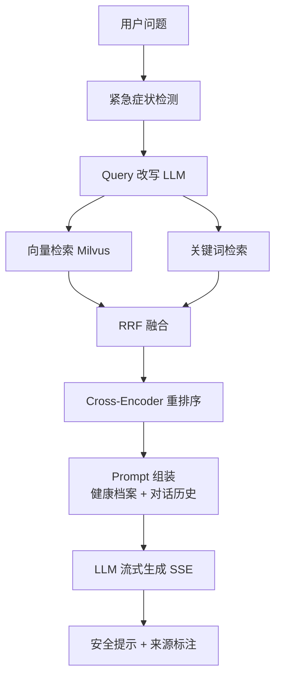

<div align="center">

# MediRAG

**基于 RAG 架构的医疗知识智能问答系统**

*Retrieval-Augmented Generation based Medical Knowledge QA System*

SpringBoot 3 · Vue 3 · Milvus · Redis · MinIO · LangChain4j

[](https://github.com/GOOD-123-CPU/medirag-open/actions/workflows/ci.yml)
[]()
[](LICENSE)


</div>

---

## 📖 简介

MediRAG 是一套完整的医疗知识智能问答系统，将医学文档切片向量化后存入向量库，
通过 **多路召回 → RRF 融合 → 重排序 → LLM 流式生成** 的完整 RAG 链路，
为用户提供**带来源引用、可追溯**的医疗知识问答。

> ⚠️ **免责声明**：本项目仅供学习研究与产品演示，输出内容不构成医疗诊断建议，
> 不能替代专业医生的诊断与治疗。就医请前往正规医疗机构。

## ✨ 核心特性

- **工业级 RAG 链路**：向量 + 关键词（BM25 风格打分）多路召回 → RRF 融合 → Cross-Encoder 重排序 → LLM 生成
- **开箱即用的工程化**：全链路 TraceId 日志追踪、接口限流、Swagger/OpenAPI 文档、37 个单元测试 + JaCoCo 覆盖率
- **安全内建**：JWT 强度校验、Redis 限流、DOMPurify 防 XSS、CI 级 gitleaks 密钥扫描与依赖审查
- **医疗安全兜底**：紧急症状检测 + 置信度评估，证据不足时明确提示而非编造
- **来源可溯**：每条回答标注引用的医学文献章节与页码
- **检索过程可视化**：改写、召回、融合、重排全过程可查，适合教学与答辩
- **流式输出**：SSE 打字机效果，对话体验流畅
- **运营后台**：知识库管理、AI 参数热调整、数据大屏、用户管理
- **一键部署**：Docker Compose 全家桶（MySQL/Redis/Milvus/MinIO/后端/前端）

## 🏗️ 系统架构



技术细节见 [docs/rag-pipeline.md](docs/rag-pipeline.md)。

## 🚀 快速开始（Docker 一键部署）

```bash
# 1. 克隆项目
git clone https://github.com/GOOD-123-CPU/medirag-open.git
cd medirag-open

# 2. 配置环境变量
cp .env.example .env
# 编辑 .env，至少填写：LLM_API_KEY、JWT_SECRET、DB_PASSWORD

# 3. 启动
docker compose up -d

# 4. 访问
# 前端：http://localhost
# 后端：http://localhost:8080
# API 文档：http://localhost:8080/swagger-ui/index.html
# MinIO 控制台：http://localhost:9001
```

首次启动建议（可选）：附加启动重排序微服务

```bash
docker compose --profile full up -d   # 含 reranker（首次会下载约 2GB 模型）
```

### 演示账号

| 角色 | 用户名 | 密码 |
|------|--------|------|
| 管理员 | admin | Admin@123456 |
| 医护人员 | doctor1 | Doctor@123 |
| 普通用户 | user1 | User@123456 |

> 演示账号仅供本地体验，生产部署请删除并使用强密码策略。

## 💻 本地开发

**后端**（JDK 17 + Maven 3.9+）

```bash
cd backend
mvn spring-boot:run
```

**前端**（Node 20/22）

```bash
cd frontend
npm install
npm run dev        # http://localhost:5173
```

**重排序微服务**（Python 3.11+，可选）

```bash
cd reranker-service
pip install -r requirements.txt
uvicorn main:app --port 8001
```

**检索质量评估**（Python 3.11+，离线）

```bash
python evaluation/eval_retrieval.py \
    --kb sample-data/medirag_knowledge_sample.json \
    --cases sample-data/authoritative_cases_11_departments.json
```

## 📁 项目结构

```
medirag/
├── backend/             # SpringBoot 3 后端（37 个单元测试 + JaCoCo 覆盖率）
│   └── src/main/java/com/medirag/
│       ├── service/rag/         # RAG 核心链路（每步一个可替换组件）
│       ├── service/knowledge/   # 文档解析 / 切块 / Milvus / MinIO
│       ├── controller/          # API 接口（SSE 流式 + 限流）
│       └── config/              # 安全 / 中间件配置
├── frontend/            # Vue 3 + Vite + Element Plus（DOMPurify 防 XSS，按路由代码分割）
├── reranker-service/    # Python 重排序微服务（bge-reranker-v2-m3）
├── sql/                 # 数据库初始化脚本（纯演示数据）
├── evaluation/          # 检索质量评估脚本
├── sample-data/         # PubMed 样例知识库（含 PMID/DOI 溯源）
├── docs/                # 技术文档（架构 / RAG 链路 / API / 部署 / FAQ / 路线图）
├── docker-compose.yml   # 一键部署
└── .github/workflows/   # CI（构建 + 测试 + 覆盖率 + gitleaks + 依赖审查）
```

## 📚 文档导航

| 文档 | 内容 |
|---|---|
| [docs/ARCHITECTURE.md](docs/ARCHITECTURE.md) | 系统架构、模块职责、关键设计决策、扩展指南 |
| [docs/rag-pipeline.md](docs/rag-pipeline.md) | RAG 链路逐层拆解（打分公式、融合算法、置信度模型） |
| [docs/api.md](docs/api.md) | REST/SSE 接口契约（Swagger 在线文档见下方） |
| [docs/deployment.md](docs/deployment.md) | 部署拓扑、环境变量、生产加固清单 |
| [docs/FAQ.md](docs/FAQ.md) | 常见问题排查（部署 / 效果 / 开发 / 合规） |
| [docs/ROADMAP.md](docs/ROADMAP.md) | 版本路线图与已知限制（诚实清单） |

## 🤝 贡献

欢迎 Issue 与 PR！请先阅读 [CONTRIBUTING.md](CONTRIBUTING.md)。

## 🔒 安全

发现安全漏洞请勿公开提交 Issue，流程见 [SECURITY.md](SECURITY.md)。

## 📄 许可证

[MIT License](LICENSE)

---

<div align="center">

<sub>English | <a href="README_EN.md">English Version</a></sub>

</div>
