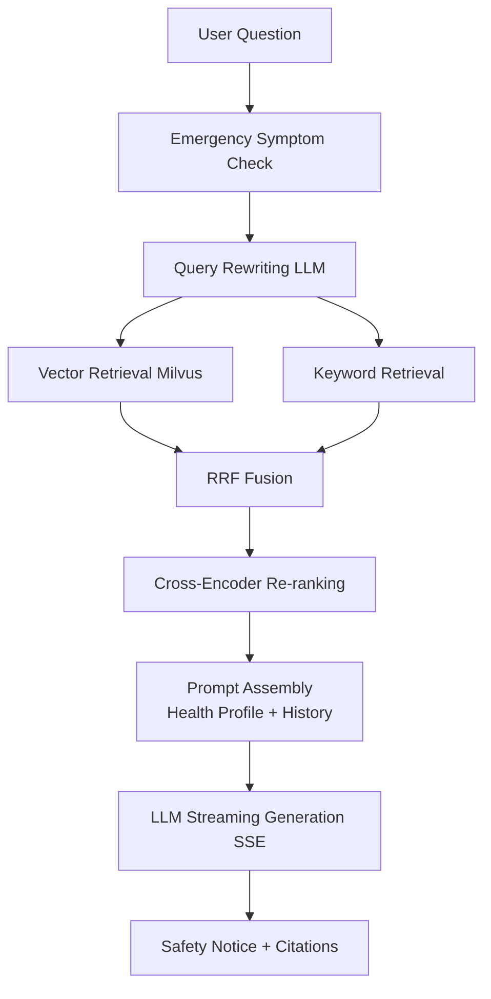

<div align="center">

# MediRAG

**RAG-based Medical Knowledge QA System**

SpringBoot 3 · Vue 3 · Milvus · Redis · MinIO · LangChain4j

[](https://github.com/GOOD-123-CPU/medirag-open/actions/workflows/ci.yml)
[]()
[](LICENSE)

</div>

---

## 📖 Introduction

MediRAG is a full-stack medical knowledge QA system built on the RAG
(Retrieval-Augmented Generation) architecture. Medical documents are chunked,
embedded and indexed into a vector database, then served through a complete
pipeline: **multi-way retrieval → RRF fusion → Cross-Encoder re-ranking →
streaming LLM generation**, producing answers with **traceable source citations**.

> ⚠️ **Disclaimer**: This project is for learning, research and demonstration
> purposes only. Its output does **not** constitute medical advice and must not
> replace professional diagnosis. Always consult qualified physicians.

## ✨ Highlights

- **Production-style RAG pipeline**: vector + keyword hybrid retrieval, RRF fusion, Cross-Encoder re-ranking
- **Medical safety guardrails**: emergency symptom detection + confidence estimation; explicit fallback when evidence is insufficient
- **Traceable citations**: every answer references document chapters and page numbers
- **Retrieval visualization**: full pipeline visibility — great for teaching and demos
- **Streaming output**: SSE typewriter effect
- **Admin console**: knowledge base management, hot AI parameter tuning, dashboard, user management
- **One-command deploy**: Docker Compose (MySQL / Redis / Milvus / MinIO / backend / frontend)

## 🏗️ Architecture



See [docs/rag-pipeline.md](docs/rag-pipeline.md) for technical details (Chinese).

## 🚀 Quick Start (Docker)

```bash
git clone https://github.com/GOOD-123-CPU/medirag-open.git
cd medirag-open

cp .env.example .env
# Edit .env: at minimum set LLM_API_KEY, JWT_SECRET, DB_PASSWORD

docker compose up -d

# Frontend: http://localhost
# Backend:  http://localhost:8080
# MinIO console: http://localhost:9001
```

Optional: enable the re-ranking microservice

```bash
docker compose --profile full up -d   # downloads ~2GB model on first run
```

### Demo accounts

| Role | Username | Password |
|------|----------|----------|
| Admin | admin | Admin@123456 |
| Medical staff | doctor1 | Doctor@123 |
| Regular user | user1 | User@123456 |

> Demo accounts are for local evaluation only. Remove them before any real deployment.

## 💻 Local Development

**Backend** (JDK 17 + Maven 3.9+)

```bash
cd backend && mvn spring-boot:run
```

**Frontend** (Node 20/22)

```bash
cd frontend && npm install && npm run dev   # http://localhost:5173
```

**Reranker service** (Python 3.11+, optional)

```bash
cd reranker-service && pip install -r requirements.txt && uvicorn main:app --port 8001
```

## 📁 Project Structure

```
medirag/
├── backend/             # SpringBoot 3 backend (Java 17)
├── frontend/            # Vue 3 + Vite + Element Plus
├── reranker-service/    # Python re-ranking microservice
├── sql/                 # DB init script (demo data only)
├── evaluation/          # Offline retrieval evaluation
├── sample-data/         # PubMed sample KB (traceable via PMID/DOI)
├── docs/                # Technical docs
├── docker-compose.yml   # One-command deployment
└── .github/workflows/   # CI (build + test + secret scan)
```

## 🤝 Contributing

Issues and PRs are welcome! Please read [CONTRIBUTING.md](CONTRIBUTING.md) first.

## 🔒 Security

Please do not open public issues for security vulnerabilities.
See [SECURITY.md](SECURITY.md).

## 📄 License

[MIT License](LICENSE)

---

<div align="center">

<sub><a href="README.md">中文版</a> | English</sub>

</div>
